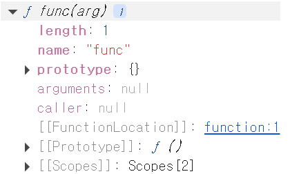
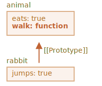
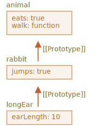
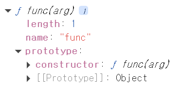
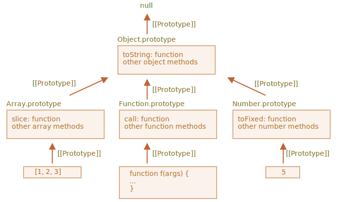

# 🌟 3주차 - 생성자 함수, 프로토타입

## 1. 생성자 함수

### 함수도 결국 객체임

**함수(Function)** 는 기본적으로 재사용 가능한 환경변수 및 코드의 묶음으로써 통용되지만

객체지향 프로그래밍인 자바스크립트 내에선 함수도 결국 일개 객체이다.

그럼 객체란 뭘까?

**객체(Object)** 라는 말은 즉, ‘자체적인 프로퍼티와 메서드를 가지는 자료구조’라는 말인데,

따라서 자연스레 ‘**객체의 일종인 함수도 자체적인 프로퍼티와 메서드를 가진다**’는 명제가 성립하게 된다.

그렇다면 함수 안에는 어떤 프로퍼티들이 내장되어 있을까?

개발자 도구를 이용해 ‘객체’로써의 함수를 잠깐 뜯어 보자.

```jsx
function func(arg) {
  return arg;
}

console.dir(func);
```

위와 같이 일반 함수 `func` 을 선언한 후 브라우저 API `console.dir` 로

함수에 내장되어 있는 프로퍼티들을 살펴 보면 아래와 같은 결과가 나온다.



이를 통해 보면 `func` 이라는 객체 안에는

`length` , `name` , `prototype` , `arguments` , `caller` 라는 프로퍼티가 내장되어 있고

`[[...]]` 형태를 가진 프로퍼티들도 포함되어 있는 것을 알 수 있다.

지금으로썬 `prototype` 은 뭔지 잘 모르겠지만

다른 프로퍼티들은 이름으로 유추하건대 해당 함수의 기본 정보,

실행되는데 필요한 조건 등이 들어 있다는 판단이 설 것이다.

### 객체의 숨김 슬롯, 그리고 함수의 종류

`name` , `length` 와 같은 값들이 프로퍼티인 건 알겠는데 `[[..]]` 형태의 프로퍼티들은 뭘까?

이 값들은 엄밀히 말하면 직접 포함된 프로퍼티가 아니라

내부적으로 추상 로직이 구현되어 있는 프로퍼티/메서드,

즉 **내부 슬롯(internal slot)** 혹은 **내부 메서드(internal method)** 라고 보는 게 맞다.

이 슬롯은 `key: value` 마냥 실질적인 형체가 있지 않으므로 외부에서 접근 불가능하지만

객체가 각자의 역할대로 동작하게 해 주는 필수 구성 요소이다.

따라서, ES 명세서 기준 이러한 내부 슬롯/메서드들을 일반 필드들과 구분하기 위해 `[[..]]` 형태로 기능에 맞는 이름을 붙여 칭한다.

(위의 `[[Prototype]]` 처럼 편의를 위해 개발자 도구에 표현해 놓기도 한다)

함수의 존재 목적은 원하는 때에 호출되여 지정된 코드를 실행시키는 것이다.

따라서, 함수는 대표적으로 **호출 로직을 구현**해 놓은 내부 메서드 **`[[Call]]`** 과 **`[[Construct]]`** 를 가진다.

- `[[Call]]`
  `fn()` 키워드로 함수 호출을 가능하게 하는 내부 메서드. (**일반 함수** 로써의 기능)
  → 이 슬롯이 구현되어 있어 함수는 **callable** (호출 가능) 하다.
- `[[Construct]]`
  `new` 키워드와 함께 함수 호출을 가능하게 하는 내부 메서드. (**생성자 함수** 로써의 기능)

이 때, `[[Construct]]` 메서드 포함 여부를 기준 삼아 함수는 크게 두 가지 종류로 나뉜다.

| 분류            | **Constructor**        | **Non-Constructor**      |
| --------------- | ---------------------- | ------------------------ |
| `[[Construct]]` | 포함                   | 미포함                   |
| 요소            | 선언문, 표현식, 클래스 | 객체 메서드, 화살표 함수 |

이 때 `[[Construct]]` 메서드를 포함해서 `new` 키워드에 반응하는 동작이 구현된 함수가 바로

**Constructor Function(생성자 함수)** 인 것이다.

### 생성자 함수(constructor function)

생성자 함수는 `new` 키워드와 함께 호출하여 객체를 생성하고 해당 객체의 초기 상태(`this`)를 바인딩하는 함수이다.

쉽게 말하면 그냥 지정한 메서드/프로퍼티를 포함하는 객체들을 대량 생산하는 객체 공장.

(비슷한 구조로 노드를 찍어내는 함수형 컴포넌트를 생각해 보자. 이 또한 객체(DOM노드)를 반환하는 생성자 함수의 일종이다.)

생성자 함수는 아래처럼 `new` 키워드와 함께 호출 시 내부 동작에 의해 객체를 반환하게 된다.

대체로 객체 생성 목적으로 선언한 생성자 함수의 이름은 **PascalCase** 로 명명하며,

생성자 함수에 의해 정해진 형태로 생성/반환된 객체는 **인스턴스(Instance)** 라고 칭한다.

```jsx
const instance = new Object([value]); // Object 함수를 기반으로 객체 생성
const func = new Function(); // 인수를 필요로 하지 않는 함수는 괄호 생략 가능
```

### 생성자 함수가 객체를 반환하는 내부 동작 - `[[Construct]]` 메서드

생성자 함수는 `[[Construct]]` 내부 메서드를 가지는 함수이다.

그리고 이 메서드 덕분에 `new` 키워드를 만났을 때 생성자 함수는 객체를 반환한다고 했다.

간단하게 `[[Construct]]` 에 구현된 로직을 알아 보자.

아래와 같은 템플릿으로 유저 정보 객체를 여러 개 찍어내고 싶다고 해 보자.

이 때, 인수로는 유저의 이름을 받아 호출 시마다 넘겨준 사람의 정보 객체를 찍어내게 해야 한다.

```jsx
const user = {
	name: string      // 유저 이름
	isAdmin: boolean  // 관리자인가? (user.name이 'Admin'일 때에만 true)
}
```

위처럼 유저 이름을 인수로 받아와 정보 객체를 반환하는 생성자 함수 `User` 는 아래와 같이 생겼다.

`this` 는 함수 호출 시점에 ‘누가 호출했는지’를 나타내는 포인터 값이다.

`new` 와 함께 생성자 함수 호출 시 `this` 키워드는 `[[Construct]]` 에 의해 **반환할 인스턴스**를 가리키게 된다.

즉 `this.name` 과 `this.isAdmin` 에 값을 할당해서 인스턴스의 프로퍼티를 추가(or수정)할 수 있다.

```jsx
function User(name) {
  this.name = name;
  this.isAdmin = name === 'Admin';
}

const minji = new User('minji'); // (*)
```

위 코드에서 `(*)` 표시한 줄은 내부적으로 아래와 같은 동작을 한다.

```jsx
const minji = new User('minji');

// [[Construct]]()
{
  // this = {};  -> 빈 객체 생성, this에 할당(초기화)

  // User 함수 본문
  this.name = name; // this = {name: 'minji'}
  this.isAdmin = name === 'Admin'; // this = {name: 'minji', isAdmin: false}

  // return this;  -> 만들어진 this를 반환
}
```

1. `new User(name)` 로 생성자 함수 호출, `new` 키워드에 `[[Construct]]` 메서드 반응
2. 내부적으로 빈 객체를 만들어 `this` 에 바인딩(참조)
3. `User` 함수 내부에 구현된 코드블록 순차 실행, 객체에 프로퍼티/메서드 삽입
4. 만들어진 객체를 반환함

이 때 생성자 함수에 구현된 코드가 하는 일은 ‘프로퍼티/메서드를 인스턴스에 삽입’하는 것뿐이다.

내부적으로 빈 객체를 만들어 `this` 바인딩,

만든 객체를 return하는 것은 `new` 키워드와 반응한 `[[Construct]]` 메서드가 일으키는 동작이다.

### 메타 프로퍼티 new.target

`new` 키워드는 객체가 아니고 연산자이지만 프로퍼티 비슷하게 구현해 놓은 것이 있다.

실제로 프로퍼티에 접근하는 것은 아니지만 프로퍼티와 비슷한 문법으로 동작하게 만든 것이 바로 **메타 프로퍼티(meta property)** 이며, `new` 의 메타 프로퍼티격으론 `new.target` 이 있다.

`new.target` 은 생성자 함수가 `new` 키워드로 호출되었을 땐 함수 그 자체를,

`new` 키워드 없이 호출되면 `undefined` 를 나타낸다.

이를 생성자 함수 내부에 이용, `new` 키워드로 호출하지 않았을 시엔

`new` 키워드를 붙여 다시 호출한 인스턴스를 반환해서 실수를 미연에 방지할 수 있다.

```jsx
function User() {
  if (!new.target) return new User();

  // ...
}
```

## 2. 프로토타입

### 객체지향 프로그래밍(Object-Oriented Programming)

객체지향 프로그래밍은 모든 데이터와 동작을 하나의 단위로 묶어 표현,

객체들 간 상호작용으로 프로그램을 구성하는 일종의 패러다임이다.

대표적으론 프로그램에 필요한 속성(프로퍼티)과 동작(메서드)만 뽑아 데이터를 **추상화(abstraction)** 하고,

사용자에게 불필요한 속성들은 외부에 노출되지 않도록 **캡슐화(encapsulation)** 하여

필요하다면 다른 객체에 속성을 **상속(inheritance)** 시키면서 프로그램을 구성한다는 특징이 있다.

자바스크립트 역시 객체지향 프로그래밍으로써,

앞서 짚은 바 있지만 함수를 포함해 거의 모든 데이터가 객체이다.

원시형 데이터는 객체는 아니지만 이 또한 래퍼 객체로 감싸 메서드를 호출하는 등 객체처럼 사용할 수 있다.

이 때, **상속** 은 모든 데이터들이 기본/응용 동작을 가능하게 하는 하는 핵심 개념인데

JS에서는 **프로토타입** 기반으로 객체 간 상속이 구현되어 있다.

### 프로토타입(Prototype)

**prototype**

→ \*\*\*\*어떤 사물/개념에 대한 원형(原型).

자바스크립트에선 프로토타입 기반 상속이 구현되어 있다.

즉, 객체 **B가 A의 속성을 상속받는다** 면 **A는 B의 프로토타입** 이라고도 할 수 있다.

모든 객체는 내부 슬롯으로 `[[Prototype]]` 을 가지며,

이 슬롯은 **해당 객체의 프로토타입** 으로 연결되는 **참조값** 을 가진다.

(참조 = 데이터X 데이터에 접근하기 위해 거쳐야 하는 추상적인 경로.)

아래처럼 각자 독립된 프로퍼티를 가지는 객체 `animal` 과 `rabbit` 이 있다고 해 보자.

`animal` 은 속성으로 `eats` 프로퍼티와 `walk` 메서드가 구현되어 있고

`rabbit` 은 `jumps` 라는 프로퍼티만 있다.

```jsx
let animal = {
  eats: true,
  walk() {
    alert('동물은 걷는다.');
  },
};

// [[Prototype]] -> animal
let rabbit = {
  jumps: true,
};
```

이 때 `rabbit` 의 프로토타입, 즉 `[[Prototype]]` 슬롯을 `animal` 객체에 이어지도록 연결하면(참조값 할당)

`rabbit` 은 `animal` 의 속성을 상속받아 자신의 속성인 것처럼 접근, 혹은 호출할 수 있게 된다.



```jsx
console.log(animal.eats); // true
animal.walk(); // 동물은 걷는다.

console.log(rabbit.eats); // true
rabbit.walk(); // 동물은 걷는다.
```

### 프로토타입 체인

그런데, `animal` 을 상속받는다고 해서

갑자기 `rabbit` 객체가 아래처럼 ‘확장’되는 것은 아니다.

```jsx
// (X) 상속받은 프로퍼티/메서드는 추가되지 않음
rabbit {
	eats: true,
	walk() {
    alert("동물은 걷는다.");
  },
  jumps: true
}

// (O) 이 상태 그대로 유지
rabbit {
  jumps: true
};
```

`animal` 을 상속받든 안 받든 간에 `rabbit` 은 이전 형태를 그대로 유지한다.

그냥 상속받은 값으로 이동하는 경로를 얻어 **접근** 만 가능해졌을 뿐이다.

이 때 더 나아가 `rabbit` 을 상속받는 객체인 `longEar` 가 정의된다면?

```jsx
let animal = {
  eats: true,
  walk() {
    alert('동물은 걷는다.');
  },
};

// [[Prototype]] -> animal
let rabbit = {
  jumps: true,
};

// [[Prototype]] -> rabbit
let longEar = {
  earLength: 10,
};
```



```jsx
longEar.walk(); // 동물은 걷는다. (animal에서 상속받음)
alert(longEar.jumps); // true (rabbit에서 상속받음)
```

`longEar` 가 `animal` 의 속성까지 상속받아 접근 가능하게 되었다.

이처럼 프로토타입 슬롯을 링크드 리스트(객체가 프로퍼티로 다른 객체 참조값을 갖는 형태)로 연결,

자손 객체가 조상 객체의 속성을 간접적으로 상속받는 것을 **프로토타입 체인(prototype chain)** 이라고 한다.

즉 `longEar` 의 `[[Prototype]]` 에 `rabbit` 참조값 저장

→ `rabbit` 의 `[[Prototype]]` 에 `animal` 참조값 저장

→ `animal` 의 `[[Prototype]]` 에 또 다른 객체 참조값 저장

→ …

와 같은 형태가 된다.

하지만 하위 객체에서 상위 객체의 참조를 이용해 상위 객체를 직접 수정할 수는 없다.

아래와 같이 상속받은 이름과 동일한 프로퍼티를 쓰면 그냥 해당 객체의 정적 프로퍼티가 만들어질 뿐이다.

```jsx
// [[Prototype]] -> animal
let rabbit = {
  jumps: true,
};

// [[Prototype]] -> rabbit
let longEar = {
  earLength: 10,
};

longEar.jumps = false;

console.log(longEar.jumps); // false
console.log(rabbit.jumps); // true
```

이 때 체인 내 동일한 프로퍼티 및 메서드가 있다면 하위 객체의 속성에 우선 접근한다.

데이터의 식별자에 접근할 땐 아래와 같이 체인을 역순으로 거슬러 올라가며 가장 먼저 발견한 값을 불러오기 때문이다.

```jsx
현재 스코프 탐색
→ (미발견) 프로토타입 참조로 이동
→ 해당 스코프 탐색
→ (미발견) 프로토타입 참조로 이동
→ …
→ (미발견) undefined
```

자바스크립트의 프로토타입 기반 상속의 강력한 점은 바로 여기에 있는데,

아래 특징들을 기반으로 유연하게 설계되어 있기 때문이다.

1. 확장X 속성 추가X **참조를 통한 접근** 만 하므로 메모리 절약(C++, Java 등 타 OOP는 확장 상속함)
2. 데이터 그 자체가 아닌 참조값이므로 프로토타입 객체 속성 수정 시 상속받는 모든 자손 객체에 수정사항이 반영됨
3. 프로토타입 체인으로 인한 간접 상속 → 계층 구조 설계가 편하고 유연함

### this가 나타내는 것

`this` 또한 프로토타입에 영향을 받지 않는다.

메서드를 하위 객체에서 호출했든, 프로토타입에서 호출했든 `this` 는 ‘호출 시점’에 정해지므로 언제나 호출 주체인 객체를 가리킨다.

커다란 프로토타입 객체에 메서드를 여러 개 구현해 놓고 다른 객체들이 이를 상속받게 하는 경우가 많기 때문에 이런 특징은 유용하게 쓰인다.

상속받은 하위 메서드들은 프로토타입이 아닌 자신의 상태를 수정하기 때문이다.

메서드 저장소 프로토타입 역할을 하는 `animal` 을 `rabbit` 이 상속받게 해 보자.

아래와 같이 `animal` 에는 `isSleeping` 이라는 프로퍼티가 없지만 `isSleeping` 프로퍼티를 만드는 메서드가 존재한다.

이 때 `rabbit.sleep()` 을 호출하면?

`this` 는 호출 주체인 `rabbit` 에 바인딩되어 `animal.isSleeping` 이 아니라 `rabbit.isSleeping` 프로퍼티가 추가된다.

```jsx
let animal = {
  walk() {
    if (!this.isSleeping) {
      alert(`동물이 걸어갑니다.`);
    }
  },
  sleep() {
    this.isSleeping = true; // setter 메서드
  },
};

let rabbit = {
  name: '하얀 토끼',
  __proto__: animal,
};

// rabbit에 isSleeping 추가 후 true 할당
rabbit.sleep();

alert(rabbit.isSleeping); // true
alert(animal.isSleeping); // undefined
```

### 생성자 함수의 prototype 프로퍼티

함수는 기본적으로 프로토타입을 나타내는 `prototype` 프로퍼티를 가진다.

이 프로퍼티는 생성자 함수로 객체를 만들 때 이용되는데,

생성자 함수의 프로토타입이 객체인 경우 인스턴스의 `[[prototype]]` 에 `prototype` 의 참조값을 그대로 넘겨주게 된다.

- 함수의 프로토타입이 객체가 아닌 경우엔 이 값은 무시되고 기본값인 `Object.prototype` 으로 연결된다.

( `instance.__proto__ === F.prototype` )

따라서 생성자 함수의 `prototype` 을 수정한 후 인스턴스를 만들면

이후 만들어지는 객체들의 프로토타입 체인에 연결한 객체가 포함된다.

추가로 `prototype` 은 다음과 같이 프로로타입 경로 외 생성자의 출처를 나타내는 `constructor` 프로퍼티를 가진다.

이 `constructor` 는 해당 인스턴스를 만들어낸 생성자 함수를 **역참조**하는 값이다.



따라서, 생성자 함수로 만들어진 객체들은 출처 함수를 이용하여 또 다른 인스턴스를 만들 수도 있다.

```jsx
function Rabbit(name) {
  this.name = name;
  alert(name);
}

let rabbit = new Rabbit('흰 토끼');
let rabbit2 = new rabbit.constructor('검정 토끼');
```

### 프로토타입의 최상위 객체 Object와 빌트인(Built-in) 객체들

모든 객체의 프로토타입 체인 최상위에는 내장 객체(혹은 생성자함수/혹은 클래스) `Object` 가 위치한다.

명시적으로 프로토타입에 `null` 을 바인딩하는 경우를 제외하면 어떤 예외도 없다.

따라서 객체들은 아래와 `Object.prototype` 을 상속받아 내장 객체 메서드를 사용할 수 있다.

```jsx
Object.prototype = {
  constructor: Object,
  toString: function () {},
  hasOwnProperty: function (prop) {},
  isPrototypeOf: function (obj) {},
  valueOf: function () {},
  toLocaleString: function () {},
  // ...
};
```

체인의 최상위에 있는 `Object` 의 `prototype` 은 `null` 을 가리킨다.

잇따라 `Array` , `Function` , `Number` , `String` 등 빌트인 객체들이 연결되어 있으며

데이터 종류에 맞는 내장 메서드들이 하위 객체들로 상속되는 구조이다.



### 프로토타입을 읽고 쓰는 방법

그렇다면 프로토타입 체인을 어떻게 연결하고 어떻게 객체 간 상속을 구현하는 걸까?

`[[Prototype]]` 은 내부 슬롯이고 추상 데이터(참조값)이기 때문에 직접 읽고 쓰는 것은 불가하다.

따라서 아래와 같이 간접적으로 접근, 수정하는 방법을 써야 한다.

1. `Object` 내장 객체 접근자(getter/setter) `__proto__` 사용

   `Object.prototype` 에는 getter/setter 접근자 프로퍼티 `__proto__` 가 구현되어 있으므로 모든 객체는 이를 상속받아 쓸 수 있다.

   따라서 `obj.__proto__` 와 같이 접근하면 `get()` 메서드에 의해 객체의 프로토타입을 읽거나 `set()` 메서드에 의해 쓸 수 있는 것.

   다만 `Object` 에서 직간접적으로 상속받는 접근자이다 보니

   프로토타입을 `null` 로 명시해 만든 객체에선 사용 불가하다. 이 방식은 비권장.

2. 표준 메서드 사용

   - 프로토타입 읽기
     - `Object.getPrototypeOf(obj)` (= `Reflect.getPrototypeOf(obj)`) : 프로토타입이 참조하는 객체 열람
     - `A instanceOf B` : `B` 가 `A` 의 프로토타입 체인에 포함되는지 Boolean형 값으로 반환
   - 프로토타입 쓰기
     - `Object.create(proto)` : `proto` 를 프로토타입 참조값으로 가지는 새로운 객체 생성
       → 여기서 반환되는 객체는 `Object.prototype` 을 상속받지 않음
     - `Object.setPrototypeOf(obj, proto)` : 객체의 프로토타입 참조값을 `proto` 로 변경

3. 생성자 함수의 `prototype` 프로퍼티
   - `F.prototype = proto`
     → 프로토타입 참조 자체를 바꿈. 이전에 생성했던 인스턴스에는 반영되지 않고 앞으로 생성될 인스턴스들에 반영됨.
     - 교체 시 기존 출처 프로퍼티인 `constructor` 가 사라진다. 명시적으로 추가 가능.
   - `F.prototype.prop = newProp`
     → 이렇게 프로토타입 객체의 프로퍼티/메서드를 추가or수정하면 해당 객체를 체인에 포함하는 인스턴스 전체에 반영됨.
