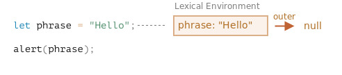
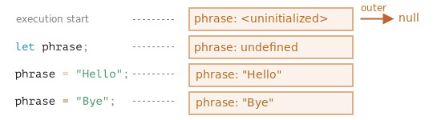
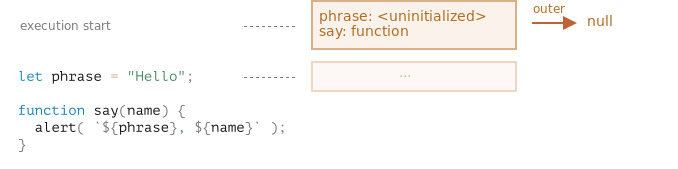
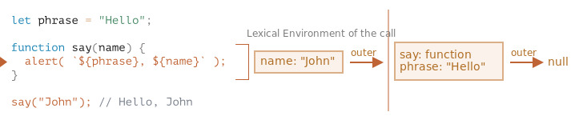
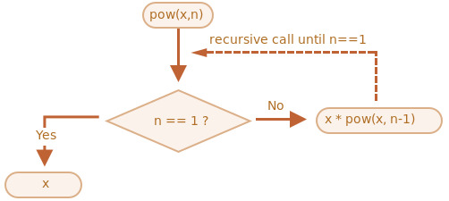

# 🌟 7주차 - 실행 컨텍스트

## 1. 실행 컨텍스트

### 실행 컨텍스트란?

**실행 컨텍스트(Execution Context)** 는 코드의 실행에 대한 세부 정보를 담고 있는 내부 데이터 구조이다.  
모든 코드는 평가 시점에 실행 컨텍스트가 생성되고 이를 참조하여 코드를 실행한다.

실행 컨텍스트가 하는 역할은 다음과 같다.

1. **코드 실행에 필요한 환경 데이터 저장 (렉시컬 환경)**

   변수, 함수 등의 식별자 스코프, 스코프 체인 참조, `this` 바인딩 등은  
   실행 컨텍스트 안에 있는 **렉시컬 환경** 에 실행 시 참조할 수 있도록 저장된다.

2. **스택을 통한 실행 순서 관리 (실행 컨텍스트 스택)**

   후입선출 구조인 **실행 컨텍스트 스택(=콜 스택)** 을 통해 관리.  
   코드는 평가된 직후 스택에 푸시되고 실행이 끝나면 스택에서 빠져나간다.  
   따라서 호출 순서가 가장 나중인, 즉 콜 스택 최상위에 위치한 컨텍스트는 실행 중인 실행 컨텍스트가 된다.

또한 실행 컨텍스트는 아래와 같은 구조를 가지고 있다.

```rust
ExecutionContext
 ├── LexicalEnvironment
 │    ├── EnvironmentRecord
 │    └── OuterEnvironmentReference
 ├── VariableEnvironment
 └── ThisBinding
```

- **렉시컬 환경 (LexicalEnvironment)**  
  → 현재 스코프 체인, 즉 참조 가능한 식별자를 저장 및 관리하는 구성 요소

  - **환경 레코드 (EnvironmentRecord)**
  - **외부 환경 참조 (OuterEnvironmentReference)**

- **변수 환경 (VariableEnvironment)**  
  → 함수 스코프 변수(`var`), 함수 선언문(일반 모드)을 저장하는 구성 요소  
  → 실행 시 초기 스냅샷처럼 기록되며, 이후 변경 사항은 렉시컬 환경에서 추척

- **ThisBinding**
  → 해당 컨텍스트에서 `this` 가 가리키는 대상
  → 화살표 함수, `eval` 등 특수 코드 제외 거의 모든 코드들이 `this` 바인딩 참조 슬롯을 가진다.

### 렉시컬 환경

**렉시컬 환경(Lexical Environment)** 은 실행 컨텍스트를 구성하는 주요 컴포넌트로써  
해당 코드의 스코프와 식별자를 관리하는 내부 숨김 연관 객체이다.

이는 두 개의 컴포넌트로 이루어져 있다.

1. **환경 레코드 (Environment Record)**

   스코프에 포함된 식별자를 등록하고 이에 바인딩된 값을 관리하는 저장 공간.  
   소스코드 타입에 따라 관리 내용에 차이가 있다.

2. **외부 렉시컬 환경 참조(Outer Lexical Environment Reference)**

   스코프 체인 상위 스코프의 렉시컬 환경으로 이어지는 참조값.  
   단방향 링크드 리스트인 스코프 체인을 따라 최상위인 전역 렉시컬 환경까지 이어진다.

   스코프 체인은 코드가 선언되는 시점에 주변 스코프 체인으로 확정되며,  
   함수의 경우 선언 시점 함수 객체의 `[[Environment]]` 라는 내부 슬롯이 참조를 저장해 놓다가  
   호출 시 렉시컬 환경에 넘겨 태어난 시점의 스코프 체인을 가져갈 수 있다.

### 실행 컨텍스트 스택

자바스크립트에서 코드는 기본적으로 동기 실행된다.

엔진이 코드 구문을 만나 한 줄씩 평가하기 시작하면 해당 코드의 컨텍스트가 콜 스택에 push되고,  
컨텍스트가 스택에서 빠져나갈 때까지 선언문을 제외한 해당 실행 컨텍스트 내부 코드들이 실행된다.

```tsx
// 전역 실행 컨텍스트 푸시
const x = 1;
const y = 2;

function sum(x, y) {
  let result = x + y;

  console.log(result);
}

// sum 실행 컨텍스트 푸시
// -> log 실행 컨텍스트 푸시
sum(1, 2);
```


> 📌 **실행 컨텍스트 스택은 후입선출 구조로, 위 코드의 실행 흐름은 아래와 같다.**
>
> 1. 전역 실행 컨텍스트 평가와 실행
> 2. `sum` 함수 실행 컨텍스트 평가와 실행
> 3. `log` 함수 실행 컨텍스트 평가와 실행
> 4. `log` 함수 실행 종료 → `sum` 함수 컨텍스트로 복귀
> 5. `sum` 함수 실행 종료 → 전역 컨텍스트로 복귀
> 6. 전역 실행 컨텍스트 실행 종료 → 스크립트 종료

따라서, 나중에 들어온 코드는 먼저 빠져나가 실행이 종료되고  
최초로 푸시되는 전역 실행 컨텍스트는 스크립트가 실행되는 동안 스택에 계속 남아있게 된다.

## 2. 코드의 평가와 실행 과정

### 소스코드의 평가와 실행

엔진이 코드를 실행할 때는 각 코드마다 아래 2단계의 과정을 거친다.

- **소스코드 평가**
  코드가 동작하기 위한 환경인 **실행 컨텍스트가 생성** 되는 과정.  
   이 시점에는 변수, 함수 등의 선언문 코드만 실행하고  
   이에 따라 생성된 식별자들을 참조 가능한 스코프에 등록한다.
- **소스코드 실행 (런타임)**
  실행 컨텍스트 기반으로 **코드를 실행하고 실행 결과를 컨텍스트에 다시 반영** 하는 과정.  
   선언문을 제외한 나머지 코드들이 한 줄씩 순차적으로 실행되며 수정 사항은 다시 스코프에 등록한다.
  함수 호출 구문을 만나면 실행을 잠시 멈추고 함수 반환값 평가가 끝났을 때 재개된다.

### 소스코드 타입

코드는 모두 평가 시점에 실행 컨텍스트가 생성된다.  
이 때 코드 타입에 따라 컨텍스트가 가지는 요소가 달라진다.

| 타입      | 설명                                                     | 스코프/내용                                                                         | 평가 시점                                                |
| --------- | -------------------------------------------------------- | ----------------------------------------------------------------------------------- | -------------------------------------------------------- |
| 전역 코드 | 전역에 존재하는 최상위 코드.<br>함수·클래스 블록 제외    | 전역 스코프 (`var`, `let`, `const` 등 전역 변수/함수)                               | 전역 코드 실행 시점<br>(스크립트 로드·파싱 후 바로 실행) |
| 함수 코드 | 함수 내부에 존재하는 코드.<br>중첩 함수·클래스 블록 제외 | 지역 스코프, 매개변수, `arguments`, 지역 변수                                       | 함수 호출 시점                                           |
| eval 코드 | `eval()` 인수로 전달된 문자열 코드                       | **일반 모드**: 호출된 컨텍스트의 스코프 공유<br>**strict 모드**: 독자적 스코프 생성 | `eval()` 호출 시점                                       |
| 모듈 코드 | 모듈 파일 내부 코드                                      | 모듈 스코프 (전역과 분리, export/import 지원)                                       | 모듈 import 시점<br>(HTML 파싱 완료 후)                  |

### 코드 평가, 실행에 따른 렉시컬 환경 변화

> 인터프리터는 `;` 를 기준으로 코드를 나누어 한 줄씩 평가한다.  
> 이 때, **평가 도중 값 할당 구문 등을 만나면 렉시컬 환경 스코프 내의 값이 업데이트된다.**
>
> 그림을 통해 코드 평가에 따른 렉시컬 환경의 변화 과정을 살펴 보자.

1. **`let` , `const` 등 환경 레코드에 저장되는 변수**

   1. 선언과 할당을 동시에 했을 때

      아래 코드에서는 `phrase` 라는 변수를 선언하자마자 `"Hello"` 라는 값을 할당한다.

      ```tsx
      let phrase = 'Hello';
      alert(phrase);
      ```

      이 때 엔진이 `let phrase = "Hello"` 구문을 평가하는 순간  
      렉시컬 환경의 스코프와 외부 참조를 그림으로 나타내면 다음과 같다.

      (전역 코드이므로 외부 렉시컬 참조(outer)는 `null` 을 가리킨다.)

      

      선언과 동시에 `phrase: "Hello"` 로 초기화된 것을 볼 수 있다.  
      이렇게 초기화된 변수는 스코프 내에서 바로 접근이 가능하다.

   2. 선언 후 값을 할당했을 때

      아래 구문은 `phrase` 를 선언만 하고 값을 할당하지 않은 경우이다.

      ```tsx
      // execution start     (1)
      let phrase; // (2)
      phrase = 'Hello'; // (3)
      pharase = 'Bye'; // (4)
      ```

      

      이 때, 인터프리터 평가 진행에 따른 렉시컬 환경의 변화 과정은 다음과 같다.

      1. 스크립트가 실행되면 전역 실행 컨텍스트가 스택에 푸시

         → 전역에서 선언한 변수 전체가 렉시컬 환경에 올라가 **선언(Declaration)** 상태가 된다. (pre-populated)

         → 이 때, 환경 레코드의 변수들은 이름 붙여지기 전인 `<uninitialized>`

         → **TDZ(Temporal Dead Zone)** 라고도 하며 엔진이 변수를 인지는 하지만 참조할 수 없는 상태이다.

      2. **초기화(initialized)** 상태

         → `let` 키워드를 통해 선언되어 식별자를 부여받은 상태.

         → 이 순간부터 접근이 가능하며 기본값으로 `undefined` 가 할당된다.

         - `var` 변수의 경우 선언 시점에 초기화가 일어나 바로 접근이 가능하다. (호이스팅)

      3. 명시적으로 값이 할당된다.

         → 이 시점부터 `phrase` 를 참조하면 `"Hello"` 가 반환된다.

      4. 명시적으로 값이 변경된다.

         → 동일 렉시컬 환경, 즉 스코프 내 동일한 식별자가 있다면 값을 덮어씌운다.

2. **함수 선언문**

   함수는 변수와 마찬가지로 값이며 객체이다.

   함수는 선언문으로 정의 시 `var` 변수와 동일하게 호이스팅되어 바로 사용할 수 있다.  
   이는 선언문 함수가 렉시컬 환경이 만들어지는 즉시 초기화되기 때문.

   스크립트에 함수를 추가했을 때 전역 렉시컬 환경의 초기 상태는 다음과 같다.  
   환경 레코드 변수인 `phrase` 는 TDZ에 있지만 함수 객체 `say` 는 바로 올라온 모습.

   

   초기화된 함수 객체 안에는 식별자, 매개변수, 프로토타입 참조,  
   `[[Call]]` 슬롯 등 실행에 필요한 모든 정보가 있으므로 바로 호출이 가능하다.

   이렇게 호출한 함수는 별도의 함수 실행 컨텍스트를 만들고 아래와 같은 순서로 렉시컬 환경을 생성한다.

   > 📌 함수 코드 평가 순서
   >
   > 1. 함수 실행 컨텍스트 생성
   > 2. 렉시컬 환경 생성
   >    1. 환경 레코드 생성
   >    2. `this` 바인딩
   >    3. 외부 렉시컬 참조 바인딩
   > 3. 함수 실행 컨텍스트 콜 스택에 푸시 → 실행

3. **렉시컬 환경 식별자 검색 과정 - 외부 렉시컬 환경**

   함수를 호출해 실행하면 새로운 렉시컬 환경이 자동으로 만들어진다.  
   이 렉시컬 환경엔 함수 호출 시 넘겨받은 매개변수와 함수의 지역 변수가 저장된다.

   `say("John")` 으로 호출하면 아래와 같은 변화가 일어난다.

   

   함수 호출 중엔 환경 레코드 부분인 **내부 렉시컬 환경**, 그리고 이가 참조하는 **외부 렉시컬 환경 을 가지게 된다.**

   - 내부 렉시컬: 예시에서는 함수 `say` . 호출 때 전달받은 인수가 들어 있는 상태. ( `name = "John"` )
   - 외부 렉시컬: 예시에서는 전역 환경. 이는 변수 `phrase` 와 함수 `say` 를 프로퍼티로 갖는다.

   코드에서 변수에 접근할 땐 내부 스코프 → 외부 스코프 순으로 범위를 확장하면서 검색한다.

   현재 스코프에서 식별자를 찾지 못하면 outer 참조를 따라  
   외부 렉시컬 환경으로 이동 후 다시 검색, 여기서도 찾지 못하면 다시 outer로 이동 후 검색을 반복한다.

   따라서 전역은 마지막에 검색되고 전역 스코프 이상은 `null` 을 참조하게 되어 에러가 발생한다.  
   (비엄격 모드에선 해당 변수를 새로 만듬)

### 코드 평가, 실행에 따른 실행 컨텍스트와 콜 스택의 변화

> 📌 함수 코드 실행 도중, 다른 함수의 호출 구문을 만나면 실행 컨텍스트는 아래와 같이 변화한다.
>
> - 현재 함수 실행이 일시 중지된다.
> - 중지된 함수의 실행 컨텍스트는 콜 스택에서 빠져나가지 않고 그대로 유지된다.
> - 새로 호출된 중첩 함수의 실행 컨텍스트가 콜 스택에 푸시된다.
> - 중첩 함수의 코드가 실행된다.
>   → 도중 함수 호출 구문을 만나면 다시 중지, 중첩 함수 코드를 실행한다.
> - 중첩 함수의 코드 실행이 완료되고 스택에서 빠져나가면,
>   중단되었던 함수가 스택에 저장된 컨텍스트 정보를 가지고 이전 실행 흐름을 이어간다.

> 앞서 코드 흐름에 따라 실행 컨텍스트 내부의 렉시컬 환경 변화를 살펴 보았다.  
> 이제, 함수를 선언하고 **호출하는 과정에서 호출 환경에 따른 실행 컨텍스트와 스택 변화**를 관찰해 보자.

아래와 같이 `x` 를 `n` 번 제곱해 주는 `pow` 함수가 있다.  
`n` 이 1이 될 때까지 `n` 자리에 `n - 1` 을 대입해 스스로 반복 호출하는 재귀 함수 형태.

```tsx
function pow(x, n) {
  if (n == 1) {
    return x;
  } else {
    return x * pow(x, n - 1);
  }
}
```



↑ 구조도

만약 `pow(2, 4)` 를 호출한다면 아래와 같은 재귀 단계가 차례로 이어질 것이다.

`pow(2, 4) = 2 * pow(2, 3)`

-> `pow(2, 3) = 2 * pow(2, 2)`

-> `pow(2, 2) = 2 * pow(2, 1)`

-> `pow(2, 1) = 2`

이제, 아래와 같이 `pow(2, 3)` 을 호출하며  
코드 흐름에 따른 실행 컨텍스트의 변화를 살펴 보자.

```tsx
let twoPowerThree = pow(2, 3); // <-- 인터프리터

console.log(twoPowerThree);
```

1. **pow(2, 3)**

   호출하는 순간 실행 컨텍스트가 생성되고 초깃값이 평가된다.  
   매개변수에는 `x = 2, n = 3` 이 할당되고, 현재 실행 흐름은 함수 첫 번째 줄에 위치한다.

   ```jsx
   function pow(2, 3) {         // <-- 인터프리터
     if (n == 1) {
       return x;
     } else {
       return x * pow(x, n - 1);
     }
   }
   ```

   이후 평가가 완료되고 실행 컨텍스트가 콜 스택에 푸시되면 함수 내부 코드가 실행을 시작한다.  
   `n !== 1` 이므로 바로 `else` 분기로 넘어가게 된다.

   변수의 변화는 없지만 실행 흐름은 5번째 줄로 옮겨갔다.

   ```jsx
   function pow(2, 3) {
     if (n == 1)
       return x;
     } else {
       return 2 * pow(2, 3 - 1); // <-- 인터프리터
     }
   }
   ```

   이 시점의 실행 컨텍스트와 실행 컨텍스트 스택을 간략하게 도식화하면 아래와 같다.

   | index | execution stack                                         |
   | ----- | ------------------------------------------------------- |
   | **0** | **`Context: { x: 2, n: 3, Line 5 }` call: `pow(2, 3)`** |

2. **pow(2, 2)**

   반환값을 평가하는 도중 다시 함수 호출 구문을 만났으므로,  
   `pow(2, 3)` 은 잠시 실행을 중단하고 `pow(2, 2)` 로 실행 흐름이 넘어간다.

   ```tsx
   function pow(2, 2) {
     if (n == 1)
       return x;
     } else {
       return 2 * pow(2, 2 - 1); // <-- 인터프리터
     }
   }
   ```

   이 경우에도 아직 `n !== 1` 이므로 다시 `else` 문 분기로 빠진다.  
   따라서 `pow(2, 2)` 역시 5번째 줄에서 실행을 보류하고 다음 함수를 호출하게 된다.

   나중에 호출된 함수는 콜 스택의 최상단에 push되므로,  
   현재까지 실행 컨텍스트 스택 상황은 아래와 같다.

   | index | execution stack                                         |
   | ----- | ------------------------------------------------------- |
   | **1** | **`Context: { x: 2, n: 2, Line 5 }` call: `pow(2, 2)`** |
   | 0     | `Context: { x: 2, n: 3, Line 5 }` call: `pow(2, 3)`     |

3. **pow(2, 1)**

   호출된 `pow(2, 1)` 로 실행 흐름이 이동한다.  
   해당 호출은 `n == 1` 을 만족하므로 재귀 호출이 없는 `if` 분기로 넘어가게 된다.

   ```tsx
   function pow(2, 1) {
     if (n == 1)
       return 2;            // <-- 인터프리터
     } else {
       return x * pow(x, n);
     }
   }
   ```

   `pow(2, 1)` 의 실행이 끝나기 전 콜 스택엔 아래와 같이 컨텍스트가 쌓여 있다.

   | index | execution stack                                         |
   | ----- | ------------------------------------------------------- |
   | **2** | **`Context: { x: 2, n: 1, Line 3 }` call: `pow(2, 1)`** |
   | 1     | `Context: { x: 2, n: 2, Line 5 }` call: `pow(2, 2)`     |
   | 0     | `Context: { x: 2, n: 3, Line 5 }` call: `pow(2, 3)`     |

4. **실행 종료 (recursive base 도달)**

   `pow(2, 1)` 의 반환값이 평가되면 return문이 실행된다.

   이후 반환된 값은 호출자인 `pow(2, 2)` 의 컨텍스트로 전달함과 동시에,  
   `pow(2, 1)` 의 실행 컨텍스트는 스택에서 빠지며 삭제된다.

   | index | execution stack                                                         |
   | ----- | ----------------------------------------------------------------------- |
   | **1** | **`Context: { x: 2, n: 2, Line 5, pow(2, 1) => 2 }` call: `pow(2, 2)`** |
   | 0     | `Context: { x: 2, n: 3, Line 5 }` call: `pow(2, 3)`                     |

   이제 콜 스택의 최상단에 위치한 `pow(2, 2)` 가 실행을 이어 간다.

   저장되어 있던 컨텍스트의 정보를 토대로 5번째 줄인 `return 2 * pow(2, 1)` 이 마저 실행되는데,  
   이 때 재귀 호출로 얻은 반환값을 대입하여 값 평가가 가능해진다.

   따라서 `pow(2, 2)` 도 return문을 실행할 수 있게 된다.

   | index | execution stack                                                         |
   | ----- | ----------------------------------------------------------------------- |
   | **0** | **`Context: { x: 2, n: 3, Line 5, pow(2, 2) => 4 }` call: `pow(2, 3)`** |

   이에 따라 마지막 남아 있는 `pow(2, 3)` 의 반환값이 평가되고  
   비로소 모든 함수들이 스택에서 빠져나가며 실행 결과를 얻을 수 있게 되었다.

   ```tsx
   let twoPowerThree = pow(2, 3);

   console.log(twoPowerThree); // 8   <-- 인터프리터
   ```
