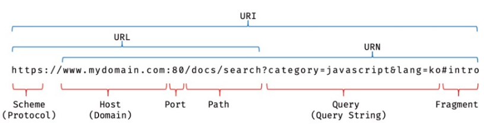
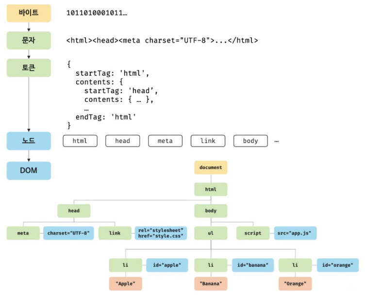
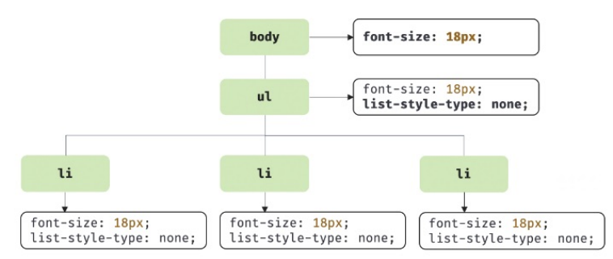
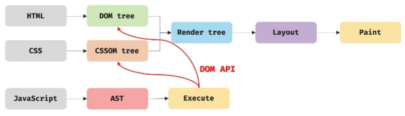
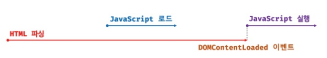

# 🌟 38장 - 브라우저의 렌더링 과정

브라우저가 HTML, CSS, JavaScript로 작성된 텍스트 문서를  
어파싱(해석)하여 브라우저에 시각적으로 렌더링하는 과정을 살펴 보자.

## 1. 요청과 응답

브라우저의 핵심 기능은 사용자가 참조하고자 하는 리소스를 서버에 **요청(Request)** 하고  
서버로부터 **응답(Response)** 받아 브라우저에 시각적으로 렌더링하는 것이다.

### 브라우저 주소창의 역할

브라우저 주소창에 URL을 입력하고 엔터를 누르면  
URL의 호스트 이름이 DNS를 통해 IP 주소로 변환되고  
해당 IP 주소를 갖는 서버에게 요청을 전송한다.

1. DNS 조회 → IP 주소 획득 (예: 172.217.175.99)

2. 해당 서버에 HTTP 요청 전송

3. 서버가 응답 반환 (HTML, CSS, JS 등)

### 정적 파일 요청

루트 요청(`/`)의 경우 암묵적으로 `index.html` 을 응답하도록 설정되어 있다.  
`index.html` 이 아닌 다른 정적 파일을 요청하려면 경로와 파일명을 URI에 기술하면 됨.

이 때 요청과 응답 과정을 상세히 확인하고 싶다면 개발자 도구의 Network 패널을 보면 된다.



- **Scheme (Protocol)**
  브라우저가 사용해하는 프로토콜.  
   웹에서는 주로 `http` 나 `https` 를 사용한다.
- **Host (Domain)**
  요청을 받는 웹 서버의 도메인 이름 또는 IP 주소.  
   네트워크상에서 서버를 찾기 위한 주소이다.
- **Port**
  웹 서버의 포트 번호.  
   생략 가능하며 생략 시 기본 포트를 사용한다.
  (기본값은 `http` → 80번, `https` → 443번)
- **Path**
  웹 서버의 리소스 경로.  
   서버 내부의 파일이나 자원 위치를 나타낸다.
- **Query String**
  웹 서버에 제공하는 추가 파라미터.  
   `?`로 시작하며 `key=value` 형태이다. 여러 파라미터는 `&`로 구분한다.
- **Fragment**
  리소스 내부의 특정 위치를 가리킨다.  
   `#`로 시작하며 주로 HTML 문서 내 앵커(anchor)  
   서버로 전송되지 않고 브라우저에서만 사용됨.

## 2. HTTP 1.1과 HTTP 2.0

### HTTP/1.1의 한계와 HTTP/2에서의 개선

**HTTP/1.1** 은 기본적으로 커넥션당 하나의 요청과 응답만 처리한다.  
즉, 여러 개의 리소스 요청이 개별적으로 전송되고 응답 또한 개별적으로 전송된다.

**HTTP/2** 는 **다중 요청/응답(Multiplexing)** 이 가능하다.  
때문에, 여러 리소스의 동시 전송이 가능해져 페이지 로딩 속도가 50%가량 빠르다.

|           | HTTP/1.1 | HTTP/2             |
| --------- | -------- | ------------------ |
| 요청 방식 | 순차적   | 병렬 처리          |
| 속도      | 느림     | 빠름 (약 50% 개선) |
| 헤더 압축 | 없음     | HPACK 압축         |

## 3. HTML 파싱과 DOM 생성

브라우저 요청에 의해 서버가 응답한 HTML 문서는 문자열로 이루어진 순수한 텍스트이므로,  
이를 브라우저에 시각적으로 렌더링하기 위해선 브라우저가 이해할 수 있는 데이터로  
**파싱(Parsing)** 해 메모리에 저장하는 과정이 필요하다.

가령 아래와 같은 `index.html` 이 서버로부터 응답되었다고 가정해 보자.

```tsx
<!DOCTYPE html>
<html>
	<head>
		<meta charset="UTF-8">
		<link rel="stylesheet" href="style.css">
	</head>
	<body>
		<ul>
			<li id="apple">Apple</li>
			<li id="banana">Banana</li>
			<li id="orange">Orange</li>
		</ul>
		<script src="app.js"></script>
	</body>
</html>
```

위의 문서는 렌더링 엔진을 통하여 파싱된 후  
아래와 같은 **DOM(Document Object Model)** 객체로 생성된다.



## 4. CSS 파싱과 CSSOM 생성

렌더링 엔진은 HTML을 처음부터 순차적으로 파싱하다가  
`<link>` 나 `<style>` 태그를 만나면 HTML 파싱을 일시 중단한다.

그리고 해당 태그에 지정된 CSS 파일을 서버에 요청하여 받아온 뒤,  
HTML과 동일한 과정을 거쳐 CSS를 파싱한 객체 **CSSOM(CSS Object Model)** 을 생성한다.  
이후 CSS 파싱 완료 후엔 중단된 지점부터 다시 HTML을 파싱하게 된다.

가령 css 파일이 아래와 같은 구문을 포함하고 있다고 치면,

```css
body {
  font-size: 18px;
}

ul {
  list-style-type: none;
}
```

해당 구문은 아래와 같은 CSSOM 트리로 변환된다.



## 5. 렌더 트리 생성

DOM과 CSSOM은 렌더링을 위해 **렌더 트리(Render Tree)** 로 결합된다.  
렌더 트리는 렌더링을 위한 트리형 자료구조로, 화면에 실제 렌더링되는 노드만으로 구성된다.

> 💡 렌더 트리에서 제외되는 요소
>
> - `display: none` 이 적용된 노드
> - `<meta>`, `<script>` 태그 등 브라우저 화면에 표시되지 않는 노드

이후 완성된 렌더 트리는 각 HTML 요소의 레이아웃(위치와 크기) 계산과  
화면에 픽셀을 렌더링하는 페인팅(painting) 처리에 입력된다.

브라우저 렌더링 과정은 반복 실행될 수 있으며,  
다음과 같은 경우에 반복해서 레이아웃 계산/페인팅이 재차 실행된다.

- 자바스크립트에 의한 노드 추가/삭제
- 브라우저 창 리사이징에 의한 뷰포트 크기 변경
- 요소의 레이아웃 변경을 발생시키는 스타일 변경

위와 같이 레이아웃 계산과 페인팅이 재차 일어나는 **리렌더링(Rerendering)** 은  
성능 상 비용이 많이 드는 작업으로, 코드를 짤 때 가급적 리렌더링을 최소화하는 것이 중요하다.

## 6. 자바스크립트 파싱과 실행

### 자바스크립트 파싱

렌더링 엔진은 HTML을 파싱하다가 자바스크립트를 로드하는 `<script>` 태그를 만나면  
DOM 생성을 일시 중단하고 자바스크립트 엔진에게 제어권을 넘긴다.

### 자바스크립트 파싱 과정

1. **토크나이징(Tokenizing)**

   소스코드를 토큰으로 분해하는 과정.  
   렉싱(Lexing) 이라고도 부르지만 미묘한 차이가 있다.

2. **파싱(Parsing)**

   토큰들을 구문 분석하여 **AST(추상 구문 트리)** 를 생성하는 과정.

   > 💡 **AST(Abstract Syntax Tree)**
   >
   > 토큰에 문법적 의미와 구조를 반영한 트리형 자료 구조.  
   > 인터프리터나 컴파일러 외에도 Tyepscript, Babel, Prettier 등  
   > 트랜스파일러를 구현하는 데에도 사용된다.

3. 바이트코드 생성과 실행

   파싱 결과물로서 생성된 AST는 인터프리터가 실행할 수 있는 중간 코드인  
   바이트코드로 변환되고 인터프리터에 의해 실행된다.  
   V8 엔진의 경우 성능 최적화를 위해  
   터보팬이라는 컴파일러가 최적화된 머신 코드로 컴파일한다.

## 7. 리플로우와 리페인트

자바스크립트 코드에 DOM이나 CSSOM을 변경하는 DOM API가 사용된 경우  
변경된 DOM과 CSSOM은 다시 렌더 트리로 결합되고, 해당 렌더 트리를 기반으로  
레이아웃과 페인트 과정을 거쳐 브라우저 화면에 다시 렌더링한다.

이를 **리플로우(reflow)** , **리페인트(repaint)** 라고 한다.

- **리플로우(reflow)**
  레이아웃 계산을 다시 하는 것.  
   노드 추가/삭제, 요소 크기/위치 변경, 윈도우 리사이징 등  
   레이아웃에 영향을 주는 변경이 발생한 경우에만 실행된다.
- **리페인트(repaint)**
  재결합된 렌더 트리를 기반으로 다시 페인트하는 것.

이 때, 리플로우와 리페인트는 순차적으로 동시에 실행되는 것은 아니다.  
레이아웃에 영향이 없는 변경 (예: `color` 변경)은 리플로우 없이 리페인트만 실행된다.



## 8. 자바스크립트 파싱에 의한 HTML 파싱 중단

브라우저는 동기적(synchronous)으로,  
즉 순차적으로 HTML, CSS, JavaScript를 파싱하고 실행한다.

이는 script 태그의 위치에 따라 HTML 파싱이 블로킹되어  
DOM 생성이 지연될 수 있다는 것을 의미한다.

아래 문제 상황 예제를 살펴보자.

```html
<!DOCTYPE html>
<html>
  <head>
    <meta charset="UTF-8" />
    <link rel="stylesheet" href="style.css" />
    <script>
      const $apple = document.getElementById('apple');
      $apple.style.color = 'red'; // TypeError
    </script>
  </head>
  <body>
    <ul>
      <li id="apple">Apple</li>
      <li id="banana">Banana</li>
      <li id="orange">Orange</li>
    </ul>
  </body>
</html>
```

위 예시에선 JavaScript가 실행되는 시점에 아직 `#apple` 이 생성 전이기 때문에  
DOM 미완성 상태에서 DOM을 조작하려 해 에러가 발생한다.

이 경우 `<body>` 요소 가장 아래에 `<script>` 를 배치해 블로킹을 해결할 수 있다.  
해당 방법을 사용 시 HTML 요소들이 먼저 렌더링되어 페이지 로딩 시간이 단축된다는 장점이 있다.

```html
<!DOCTYPE html>
<html>
  <head>
    <meta charset="UTF-8" />
    <link rel="stylesheet" href="style.css" />
  </head>
  <body>
    <ul>
      <li id="apple">Apple</li>
      <li id="banana">Banana</li>
      <li id="orange">Orange</li>
    </ul>
  </body>
  <script>
    const $apple = document.getElementById('apple');
    $apple.style.color = 'red'; // 정상 작동
  </script>
</html>
```

## 9. script 태그의 async/defer 속성

앞서 살펴본 것처럼 JavaScript 파싱에 의한 DOM 생성 중단 문제를 근본적으로 해결하기 위해

HTML5부터는 `<script>` 태그에 `async` 와 `defer` 어트리뷰트가 추가되었다.

해당 속성들은 `src` 속성을 통해 외부 자바스크립트 파일을 로드하는 경우에만 사용 가능하다.  
즉, 인라인 자바스크립트에는 사용할 수 없다.

```html
<script async src="extern.js"></script>
<script defer src="extern.js"></script>
```

### async 어트리뷰트

HTML 파싱과 외부 자바스크립트 파일 로드가 비동기적으로 동시에 진행된다.  
단, 자바스크립트 파싱과 실행은 로드가 완료된 직후 진행되며 이 때 HTML 파싱이 중단된다.


**특징**

- 여러 script 태그에 async 속성 지정 시 순서 보장 X
- 로드가 완료된 자바스크립트부터 먼저 실행됨

**사용 시기**

- 순서와 상관없이 실행 가능한 스크립트 (예: Google Analytics)

### defer 어트리뷰트

async 속성과 마찬가지로 HTML 파싱과 외부 자바스크립트 파일 로드가 비동기적으로 동시에 진행된다.  
단, 자바스크립트 파싱과 실행은 HTML 파싱이 완료된 직후(DOM 생성 완료 직후) 진행된다.



**특징**

- DOM 생성이 완료된 후 실행되므로 DOM을 조작하는 스크립트에 유용
- 여러 script 태그의 경우 순서 보장

**사용 시기**

- DOM 조작이 필요한 대부분의 스크립트
